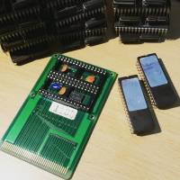
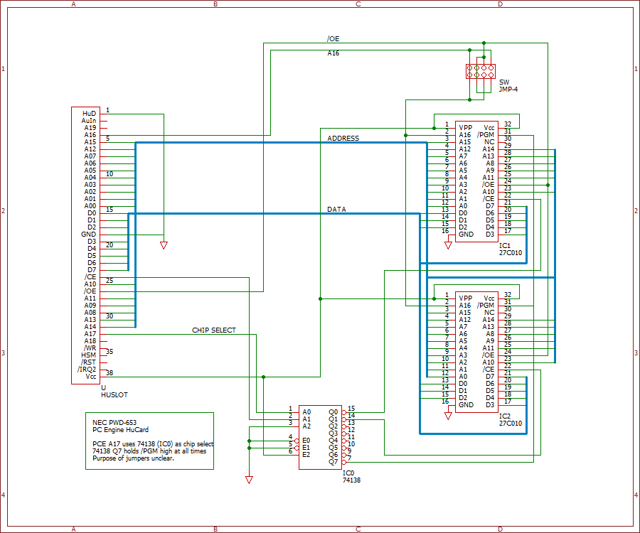

## NEC PWD-653 Socketed HuCard

 

I picked this up years ago and couldn't tell you for sure where it was used or by who. It's an NEC PWD-653 HuCard, a single extra-thick PCB with two socketed 32-pin ROM chips. Mine came with two 27C010 chips marked R-Type M0 and M1.

Based on the way it's wired, the device maxes out at 2 Mbit, or a 2-meg ROM. Quarter Megabyte. I wanted to see if I could put larger chips on it, so I traced it all out and here's what I found:

PCE line A17 is used as a chip-select. A 74138 IC performs the switching. One of the 74138 outputs holds the program line on the EPROMs high.

The only weird things are the 4 solder bridges. They're not straightforward on/off, but interlinked in a way that seems tantalizingly understandable. Basically they control whether A16 is connected, and to what. But it's possible to connect A16 to /OE as well, and the way it came someone went through the effort of closing one of the bridges (as indicated in the schematic) for no purpose at all, near as I can tell.

Anyway, the schematic:

