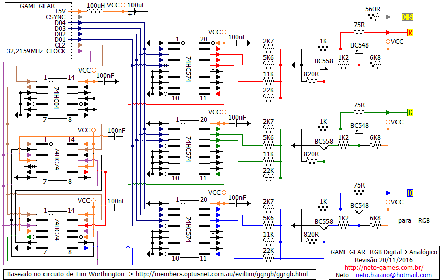
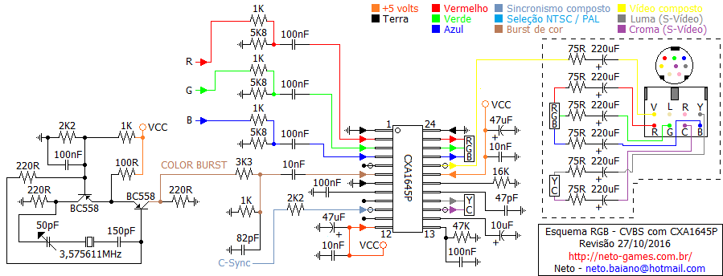

## Game Gear na TV (RGB / YPbPr / S-Vídeo / Composto)

#### 05/09/2014

   Quem nunca quis jogar o Game Gear na TV, eu sempre fui fã dos jogos do Sonic e cada vez que saia um jogo do Sonic eu ia atrás de comprar, e com o Game Gear não foi diferente, comprei um e fui comprando todos os jogos que iam sendo lançados referentes ao Sonic, enfim a SEGA lançou um placa para desenvolvedores ligarem o GAME GEAR na TV, mas uma placa muito difícil de sr encontrada. A boa noticia é que uma dessas placas foi adquirida e feito uma analise e foi desenvolvido um circuito baseado nela com as mesma funções e com peças fáceis de serem encontradas, mesmo nos dia de hoje. Uma das pessoas também desenvolveu placas prontas para serem colocadas no GAME GEAR para quem quiser adquirir esta placa pronta segue o link http://etim.net.au/ggtv/ggtv.htm, mas se você for igual eu que não compra nada lá fora por motivos diversos (Impostos, Valor, não ter cartão Internacional), nesta página também é possível encontrar o circuito para desenvolvimento, porém somente para monitores com suporte a RGB. Baseado no circuito proposto e com peças fáceis de serem encontradas no Brasil, vou apresentar alguns circuitos complementares ao circuito com os formatos de vídeo mais comuns encontradas nos televisores do Brasil. Abaixo tem a lista de componentes e uma reprodução do circuito original o qual converte o sinal de vídeo digital do Game Gear para RGB analógico.

------

### Conversor Digital Analógico RGB

   Foram desenvolvidas duas versões similares deste conversor. Uma usando o circuito integrado 74HC175 e outra usando o 74HC74, originalmente foi feito com o 74HC175, porém houve relatos da dificuldade em se encontrar o CI 74HC175, particularmente não tive problemas em encontrar, mas como pode haver problemas em algumas regiões, disponibilizo aqui as duas versões, abaixo segue a lista com ambas. O resultado final será o mesmo independente da versão montada.

#### Lista de componentes para circuito transcodificador de RGB digital para analógico:

| Versão com 74HC175                                           | Versão com 2 74HC74                                          |
| ------------------------------------------------------------ | ------------------------------------------------------------ |
| 1 - Indutor de 100uH 3 - Resistores de 75 Ohms 2 - Resistores de 220 Ohms 1 - Resistor de 560 Ohms 3 - Resistor de 820 Ohms 3 - Resistores de 1 K 3 - Resistores de 1K2 3 - Resistores de 2K7 3 - Resistores de 5K6 3 - Resistores de 6K8 3 - Resistores de 11 K 3 - Resistores de 22 K 5 - Capacitores cerâmicos de 100nF (0,1uF) 1 - Capacitor eletrolítico de 100uF 3 - Transistores BC 548 3 - Transistores BC 558 1 - Circuito Integrado 74HC04 1 - Circuito Integrado 74HC175 3 - Circuitos Integrados 74HC574 | 1 - Indutor de 100uH 3 - Resistores de 75 Ohms 2 - Resistores de 220 Ohms 1 - Resistor de 560 Ohms 3 - Resistor de 820 Ohms 3 - Resistores de 1 K 3 - Resistores de 1K2 3 - Resistores de 2K7 3 - Resistores de 5K6 3 - Resistores de 6K8 3 - Resistores de 11 K 3 - Resistores de 22 K 6 - Capacitores cerâmicos de 100nF (0,1uF) 1 - Capacitor eletrolítico de 100uF 3 - Transistores BC 548 3 - Transistores BC 558 1 - Circuito Integrado 74HC04 2 - Circuitos Integrados 74HC74 3 - Circuitos Integrados 74HC574 |

#### Esquema da versão com 74HC175  Esquema da versão com 2 74HC74 

------

### Transcodificador RGB para Vídeo Composto e Vídeo Separado (S-Vídeo / S-VHS)

   Feito o primeiro circuito devemos montar mais outro circuito para converter o sinal de RGB analógio em S-Vídeo e Video Composto, no circuito a seguir foi utilzado o CXA 1645P, o qual pode ser encontrado facilmente em sucatas de placas transcodificadoras de TV, Neo Geo CD e até em lojas especializadas. O sinal gerado será em PAL-M, que é o padrão brasileiro possibilitando ser ligado em qualquer TV com entrada AV. Devido ao fato da sub-portadora de cor ser gerada localmente de forma assíncrona ficara evidente o efeito Dot Crawl no vídeo composto, no S-Vídeo fica normal. Abaixo a lista de componentes usados:

1 - Capacitor variável de 50pF
1 - Circuito integrado CXA1645P
1 - Cristal de 3,575611MHz (PAL-M)
2 - Transistores BC558
1 - Capacitor cerâmico de 47pF
1 - Capacitor cerâmico de 82pF
1 - Capacitor cerâmico de 150pF
3 - Capacitor cerâmico de 10nF
6 - Capacitores cerâmicos de 100nF
1 - Capacitor eletrolítico polarizado de 10uF / 10V
2 - Capacitores eletrolíticos polarizados de 47uF / 10V
6 - Capacitores eletrolíticos polarizados de 220uF / 10V
6 - Resistores de 75R
1 - Resistor de 100R
3 - Resistores de 220R
5 - Resistores de 1K
2 - Resistores de 2K2
1 - Resistor de 3K3
3 - Resistors de 5K8
1 - Resistor de 16K
1 - Resistor de 47K
1 - Conector mini dim 8 (opcional)

#### Diagrama de ligação do CXA 1645P: 

------

### Conversor RGB / Vídeo Componente (YPbPr)

   E por último um circuito de conversão RGB para Vídeo Componente (Y-Pb-Pr) ideal para TVs de LCD, que não possuem entrada S-Vídeo e a imagem por composto não é muito satisfatória. Abaixo a lista de componentes da para o próximo diagrama:

5 - Transistores BC 547
7 - Transistores BC 557
2 - Diodos 1N4148
1 - Capacitor cerâmico de 56pf
3 - Capacitores eletrolíticos polarizados de 10uF / 10V
3 - Capacitores eletrolíticos polarizados de 47uF / 10V
6 - Capacitores eletrolíticos polarizados de 470uF / 10V
2 - Resistores variáveis de 500R (Trimpot)
1 - Resistor variável de 1K (Trimpot)
1 - Resistor variável de 2K (Trimpot)
1 - Resistor variável de 5K (Trimpot)
1 - Resistor de 10 Ohms
1 - Resistor de 75 Ohms
2 - Resistores de 100 Ohms
1 - Resistor de 180 Ohms
4 - Resistores de 220 Ohms
3 - Resistores de 330 Ohms
1 - Resistores de 470 Ohms
1 - Resistor de 820 Ohms
3 - Resistores de 1 K
1 - Resistor de 1K8 (1.800 Ohms)
1 - Resistor de 2K2 (2.200 Ohms)
1 - Resistor de 5K6 (5.600 Ohms)
6 - Resistores de 10 K (10.000 Ohms)
1 - Placa para montar o circuito

#### Diagrama de ligação do RGB vídeo componente:  Preferencialmente ligar o RGB nas saídas do CXA 1645P, o C-SYNC deve ser usado o do primeiro circuito.

   Este circuito tem alguns pontos críticos que influenciaram na qualidade de imagem. Como é difícil de encontrarmos resistores de precisão (1% ou menos de tolerância) e com os valores necessários para o correto balanceamento de cores. O circuito foi desenvolvido para que se possa usar os resistores mais comuns de serem encontrados 5% e na parte critica foram usados trimpots para que possamos obter os valores corretos. O valores dos trimpots para o circuito "Gerador Y" caso não consiga os valores propostos, pode se usar outros valores desde que não sejam de valores menores do que o necessário para conseguir as resistências indicadas, para os Geradores R-Y e B-Y utilizar valores maiores que os indicados influenciará na qualidade de imagem.
   Durante a montagem do circuito utilizando um multímetro digital calibre os trimpots do "Gerador Y" seguindo os seguintes valores para a entrada RGB:
\- Vermelho (R) - 1.111 Ohms (Mil cento e onze).
\- Verde (G) - 565 Ohms (Quinhentos e sessenta e cinco).
\- Azul (B) - 3.030 Ohms (Três mil e trinta).
   Para os trimpots do "Gerador R-Y / B-Y" o ideal é ter um osciloscópio no modo X-Y e aplicar um padrão de barra de cores e calibrar observando o vetor na tela do osciloscópio, mas como nem todos tem este tipo de equipamento um modo de deixar eles próximos do balanceamento correto é medir os extremos do trimpot e deixar eles posicionados na seguinte proporção 32% de resistência para o "-Y" e 68 % para o "R" e "B", por exemplo um trimpot de 500 Ohms nos extremos mede 470 Ohms no multímetro (470???? não deveria ser 500? Sim, mas os trimpots também tem tolerância de valores e podem não representar exatamente o que está marcado.) Usando a proporção este trimpot deverá ser ajustado com o valor de 150 Ohms para o lado do "-Y" e ficando 320 Ohms para o lado R / B, este é somente um valor inicial como referência para quem não possua um osciloscópio para calibrar. Com o circuito em funcionamento faça o ajuste fino até obter um correto balanceamento de cores.

------

### Fontes de informações

[Como conectar um SEGA Game Gear na TV via RGB SCART](http://members.optusnet.com.au/eviltim/ggrgb/ggrgb.html) - Tim Worthington (em Inglês).
[SMS Power!](http://www.smspower.org/) - O Melhor site de informações sobre os consoles SEGA de 8-bits (em Inglês).
[Informações técnicas de SEGA Game Gear e SEGA Master System](http://www.geocities.com/vjkemp/sega/) - Victor Kemp's website (Site fora do ar).
[Saída de vídeo RGB Video do Game Gear (!)](http://disgruntleddesigner.com/chrisc/segahacking/ggrgb.html) - página de Chris Covell's baseado no projeto de Xavier's (em Inglês).
